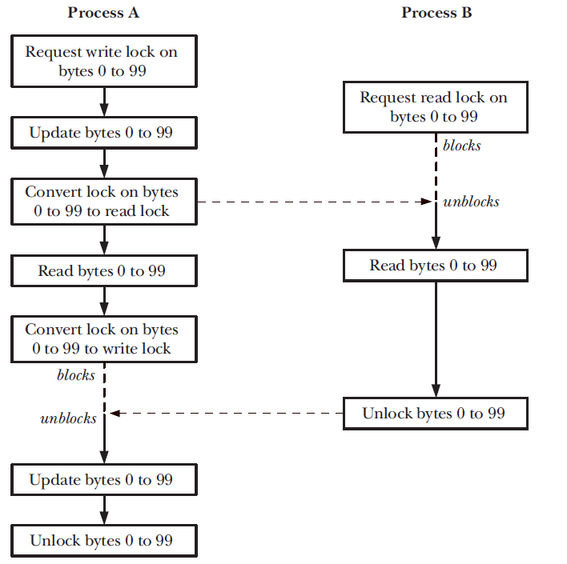

## Table of Contents
1. [Concurrency vs Parallelism vs Parallel Concurrency](#concurrency-vs-parallelism-vs-parallel-concurrency)
2. [File Locks Overview](#file-locks-overview)
3. [File Locks by `flock()`](#file-locks-by-flock)
4. [File Locks by `fcntl()`](#file-locks-by-fcntl)

# Concurrency vs Parallelism vs Parallel Concurrency
- Concurrency: In a *single-core* system, concurrency is achieved by rapidly switching between tasks (multitasking), giving the illusion that tasks are running simultaneously.

    

- Parallelism: In a multi-core system, parallelism allows tasks to run concurrently across multiple cores.

    

- Parallel Concurrency: Parallel concurrency is a combination of both concurrency and parallelism. It allows multiple tasks to run at the same time (parallelism) while managing the switching between tasks (concurrency).

    

# File Locks Overview
- Any number of processes can hold a read lock on the same file (or region of a file). However, when one process holds a write lock on a file (or file region), other processes are prevented from holding either read or write locks on that file (or file region).

    1. Advisory Locking
        - Definition: A process can ignore locks set by other processes.
        - Behavior: Locks only work if all cooperating processes use them correctly. 
        - Implementation: `flock()` and `fcntl()`

    2. Mandatory Locking
        - Definition: The operating system enforces the lock, preventing unauthorized access.
        - Behavior: If a process holds a write lock, no other process can read or write to the file.
        - Implementation: It's used when mounting file on linux with enabling mandatory locking but will cause some slowly operations on files so it's not supported anymore.   


# File Locks by `flock()`

```cpp
int flock(int fd, int operation);
```

- Operation

| Lock Type | Behavior |
|-----------|----------|
| **LOCK_SH** (Shared Lock) | Multiple processes can read the file at the same time. |
| **LOCK_EX** (Exclusive Lock) | Only one process can read/write the file. Others must wait. |
| **LOCK_UN** (Unlock) | Releases the lock so other processes can access the file. |
| **LOCK_NB** (Non-blocking) | The lock request will fail immediately if the lock cannot be acquired. |

Notes:-
------

- By default, `flock()` is blocking which calling process waits until the lock is released. To make `flock()` non-blocking, use `LOCK_NB`.

- Any number of processes may simultaneously hold a **shared lock** on a file. A shared lock allows reading but prevents writing by other processes holding an exclusive lock.

- **Exclusive lock** prevents any other process to acess this file till it release its lock. And will block if another process holds a shared lock on the file, unless `LOCK_NB` was also specified.

- **Shared to Exclusive Lock Conversion** A lock conversion is **not** guaranteed to be **atomic**. During conversion, the existing lock is first removed, and then a new lock is established. **Risk:** Another process might acquire a lock between these two steps, causing unexpected behavior.

- Locks Are Released Automatically which a process crashes, the lock is freed automatically.

- `flock()` is associated with the open file description (OFD) rather than the file descriptor or the file (i-node) itself. If you duplicate a file descriptor using `dup()` or `dup2()`, both descriptors share the same lock. And if a child process inherits an open file descriptor (from `fork()`), it also inherits the same lock. So we will gives design issue because if one of them release it, will lead to release the lock in parent process. tested into [fork issue](flock_design_issue_fork.c)

- If you open the same file **again** in the same process, the second descriptor is independent and does not share the lock. tested into [locking yourself](<Locking_Yourself .c>)


- If a process calls `exec()`, the lock remains active because `flock()` applies to the open file description, not the process. However, if `FD_CLOEXEC` (close-on-exec) is set, the lock is released when exec() runs.

- Limitions: Only whole files can be locked. Such coarse locking limits the potential for concurrency among cooperating processes.


# File Locks by `fcntl()`

- we can place a lock on any part of a file, ranging from a single byte to the entire file. This form of file locking is usually called record locking.

```cpp
int fcntl(int fildes, int cmd, struct flock *lock);
```

- `fildes` : This is the file descriptor for the file you want to lock or unlock.
- `cmd`    : This specifies the command to perform on the file. For record locking, common commands are:
    - `F_SETLK`  : Set a lock (non-blocking).
    - `F_SETLKW` : Set a lock, Wait (blocking).
    - `F_GETLK`  : Get the current lock status.
- `lock`   : This is a pointer to a `struct flock`, which defines the details of the lock, such as the type of lock (read/write), the range of bytes to lock, and more.

```cpp
struct flock {
    short l_type;    // Type of lock: F_RDLCK, F_WRLCK, or F_UNLCK
    short l_whence;  // Base for offset (e.g., SEEK_SET, SEEK_CUR, SEEK_END)
    off_t l_start;   // Starting byte offset for the lock
    off_t l_len;     // Length of the lock in bytes (0 for locking until EOF)
    pid_t l_pid;     // PID of the process holding the lock
};
```

- `l_type`  : This field specifies the type of lock:
    - `F_RDLCK` : Shared (read) lock.
    - `F_WRLCK` : Exclusive (write) lock.
    - `F_UNLCK` : Unlock.

- `l_whence`: Specifies the base of the lock's offset. It can be:
    - `SEEK_SET`: The offset is relative to the beginning of the file.
    - `SEEK_CUR`: The offset is relative to the current position.
    - `SEEK_END`: The offset is relative to the end of the file.
    
- `l_start` : This is the starting byte offset of the lock relative to `l_whence`.

- `l_len`: This specifies the length of the region to lock in bytes. A length of 0 means the lock extends to the end of the file.

- `l_pid`: This field holds the process ID of the process holding the lock (only set when the lock is in place).

    

- **Details of lock acquisition and release**    
    1. Unlocking Always Succeeds: Unlocking a region of a file always succeeds, even if the region is not currently locked. This means that calling fcntl() with the F_UNLCK command to release a lock on a region does not require that the region was locked in the first place.

    2. One Lock Type per Region: At any given time, a process can only hold one lock type (read or write) on a specific region of a file. For example, a region of a file can’t be simultaneously locked for both reading and writing by the same process.

    3. Converting Lock Types (Read Lock to Write Lock): he conversion from a read lock to a write lock may require waiting for other processes to release their conflicting locks. Thus, it's important to anticipate that this operation may not be instantaneous and may require error handling or blocking behavior.

    4. A Process Can’t Lock Itself Out: This guarantees that a process is always able to access a file it has locked, no matter how it accesses it (via different file descriptors). This ensures that the process will not be locked out of its own file regions.

    5. Locking a Region in the Middle of an Existing Lock will split into three parts: 
        The region before the new lock.
        The new lock region.
        The region after the new lock.
    So may lead to blocking issue if the middle region is in read lock with other processes.

- Example on DeadLock

    

    - To prevent this possibility, the kernel checks each new lock request made via To F_SETLKW see if it would result in a deadlock situation.
    - If it would, then the kernel selects one of the blocked processes and causes its fcntl() call to unblock and fail with the error EDEADLK.

- Record locks are not inherited across a `fork()` by a child process. Record locks are preserved across an `exec()`. Record locks are associated with both a process and an i-node 