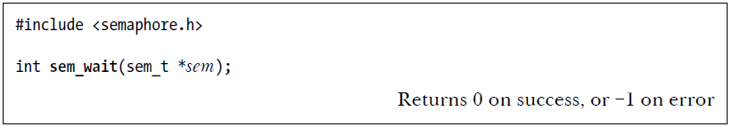

# Table Of Contents
1. [POSIX Semaphores Overview](#posix-semaphores-overview)  
2. [Named Semaphores](#named-semaphores)  
3. [Unnamed Semaphores](#unnamed-semaphores)  
4. [Key Differences](#key-differences)  
5. [Named Semaphores in Linux](#named-semaphores-in-linux)  
6. [Common Named Semaphore Syscalls](#common-named-semaphore-syscalls)  
7. [Location & Persistence](#location-persistence)  
8. [Understanding the `mode` Argument in `sem_open()`](#understanding-the-mode-argument-in-sem_open)  
9. [Breakdown of `sem_open()` Example](#breakdown-of-sem_open-example)  
10. [`sem_close()`](#sem_close)  
11. [`sem_unlink()`](#sem_unlink)  
12. [`sem_wait()`](#sem_wait)  
13. [`sem_trywait()`](#sem_trywait)  
14. [`sem_timedwait()`](#sem_timedwait)  
15. [`sem_post()`](#sem_post)  
16. [`sem_getvalue()`](#sem_getvalue)  

# POSIX Semaphores Overview
## 1. Named Semaphores
- Identified by a **unique name**.
- Allow **unrelated processes** to synchronize.
- Exist until explicitly **unlinked**.

## 2. Unnamed Semaphores
- **No name**, stored within **the process memory**.
- Used for **thread/process synchronization**.
- Exist only during the process runtime.

## 3. Key Differences
| Feature            | Named Semaphores                  | Unnamed Semaphores                |
|--------------------|--------------------------------|--------------------------------|
| **Identifier**     | Uses a **name**         | within **the process memory**     |
| **Scope**         | **Multiple processes** | **Threads/processes** |
| **Persistence**   | Exists until `sem_unlink()`    | Exists only during process runtime |
| **Creation**      | `sem_open()`                   | `sem_init()`                     |
| **Deletion**      | `sem_unlink()`                 | `sem_destroy()`                  |

# **Named Semaphores in Linux**
## 1. Common Named Semaphore Syscalls
- `sem_open()`: Creates or opens an existing named semaphore.
- `sem_post()`: Increments the semaphore value, signaling resource availability.
- `sem_wait()`: Decrements the semaphore value, blocking if unavailable.
- `sem_getvalue()`: Retrieves the current value of the semaphore.
- `sem_close()`: Removes the calling process’s association with a named semaphore.
- `sem_unlink()`: Deletes a named semaphore from the system.

## 2. **Location & Persistence**:  
  - In **some UNIX systems**, semaphores are created as **special files** in the standard filesystem.
  - In **Linux**, named semaphores are stored in **POSIX shared memory objects** under `/dev/shm/sem.name`.
  - These **persist in memory** as long as the system is running but are **lost on reboot**.

## 3. **`sem_open()`**:

  - The **`sem_open()`** function is used to create or open a named semaphore.
  - It requires a **name**, which identifies the semaphore.
  - The `oflag` argument determines the operation:
    - `0`: Open an **existing** semaphore.
    - `O_CREAT`: Create a **new** semaphore if it doesn’t exist.
    - `O_CREAT | O_EXCL`: Ensure the semaphore is **created uniquely** (fails if it already exists).
  - If `O_CREAT` is used, two more arguments are required:
    - **`mode`**: Specifies **file permissions** (like the `open()` system call).
    - **`value`**: Sets the **initial count** of the semaphore.

## 4. **Understanding the `mode` Argument in `sem_open()`**
- The `mode` is set using **octal values** (like `0644`).
- These values define the **read (`r`) and write (`w`) permissions** for the **owner, group, and others**.

    | Octal Value | Symbolic Representation | Meaning |
    |------------|------------------------|---------|
    | `0777` | `rwxrwxrwx` | Full read/write/execute access for everyone |
    | `0666` | `rw-rw-rw-` | Read/write for everyone (no execute) |
    | `0644` | `rw-r--r--` | Read/write for owner, read-only for others |
    | `0600` | `rw-------` | Read/write only for owner (private) |

---

## 5. **Breakdown of `sem_open()` in the Example**
```c
sem_open("/my_semaphore", O_CREAT | O_EXCL, 0644, 1);
```
- **`"/my_semaphore"`** → The **name** of the semaphore.
- **`O_CREAT | O_EXCL`** → Ensures the semaphore is **created uniquely**.
- **`0644`** → Sets the mode:
  - **Owner:** Read & write (`rw-`).
  - **Group:** Read (`r--`).
  - **Others:** Read (`r--`).
- **`1`** → The initial **value** of the semaphore.

## 6. **`sem_close()`**:

   - The function `sem_close()` is used to close the semaphore, which means the process no longer has access to it. 
   - This function also releases any resources the system has allocated for that semaphore in the context of the calling process.
   - The reference count of the semaphore is decreased, so the system knows how many processes are still using the semaphore.
   - Closing a semaphore via `sem_close()` does **not** delete it; it simply terminates the association for the calling process.
   - If a process terminates or calls `exec()`, all its open named semaphores are automatically closed by the system.

## 7. **`sem_unlink()`**:

   - If you want to completely remove a semaphore from the system (so no other process can access it in the future), you must use `sem_unlink()`.
   - `sem_unlink()` deletes the semaphore from the system. However, if other processes have the semaphore open, they can continue to use it until they explicitly close it using `sem_close()`.
   - This function is necessary to ensure the semaphore is cleaned up from the system after it is no longer needed.

## 8. **`sem_wait()`**
It looks like you're providing an overview of three semaphore functions (`sem_wait()`, `sem_trywait()`, and `sem_timedwait()`) and their behavior. Here's a brief summary of each:

1. **`sem_wait()`**:

    
   - **Purpose**: Decrements the value of the semaphore.
   - **Behavior**: If the semaphore value is greater than 0, it decrements the value and returns immediately. If the value is 0, it blocks until the semaphore value becomes greater than 0 (when another thread or process signals the semaphore).
   - **Blocking**: Blocks when the semaphore is 0.

2. **`sem_trywait()`**:

    
   - **Purpose**: Non-blocking attempt to decrement the semaphore.
   - **Behavior**: Attempts to decrement the semaphore value like `sem_wait()`, but if the value is 0, it returns immediately with an error code `EAGAIN` instead of blocking.
   - **Blocking**: Does not block.

3. **`sem_timedwait()`**:

    
   - **Purpose**: Decrements the semaphore value, but with a time limit.
   - **Behavior**: Works like `sem_wait()`, but includes a timeout (`abs_timeout`) specified as an absolute time value. If the semaphore can't be decremented within the specified time, it returns with the error `ETIMEDOUT`.
   - **Blocking**: Can block for a limited time (timeout specified).

## 9. **`sem_post()`**

- **Purpose**: Increments the value of the semaphore, effectively signaling that the resource it controls is now available or that a task has been completed.
- **Behavior**: 
  - Increments the value of the semaphore by 1.
  - If any other thread or process is blocked on a `sem_wait()` call, it will be woken up and allowed to proceed. The waiting thread can then attempt to decrement the semaphore again (i.e., continue with its execution).

## 10. **`sem_getvalue()`**
- **Purpose**: To obtain the current value of a semaphore.
- **Behavior**: 
  - It stores the current value of the semaphore in the variable pointed to by `sval`.
  - The value returned by `sem_getvalue()` can have two possible interpretations, depending on the implementation:
    - **Linux (POSIX standard)**: The value returned is the current value of the semaphore. 
      - If the value is `0`, it indicates that the semaphore is unavailable (i.e., threads or processes are blocked in `sem_wait()` calls).
      - If the value is positive, it shows how many increments have occurred and indicates that the semaphore is available.
    - **Alternative Interpretation** (POSIX.1 standard, though not always implemented in this way): It could return a negative value, where the absolute value represents the number of processes currently blocked on the semaphore by a `sem_wait()` call.
      - For example, if the value is `-3`, it means that three processes/threads are waiting for the semaphore.