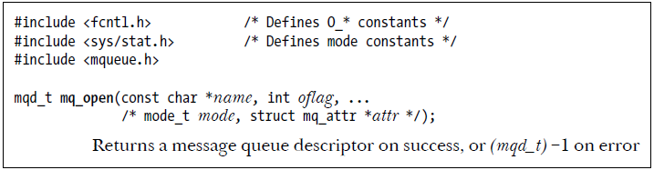
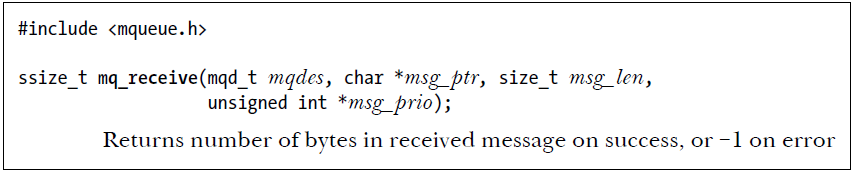

# Table of Contents  
1. **[Queues Figures](#queues-figures)**  
   - [Multiple producers & multiple consumers](#multiple-producers--multiple-consumers)  
   - [Server to Client](#server-to-client)  
   - [Service Worker Model](#service-worker-model)  

2. **[Message Queue Functions](#message-queue-functions)**  
   1. [mq_open() – Create or open a message queue](#mq_open)  
   2. [mq_send() – Send a message to a queue](#mq_send)  
   3. [mq_receive() – Receive a message from a queue](#mq_receive)  
   4. [mq_close() – Close a message queue](#mq_close)  
   5. [mq_unlink() – Remove a message queue](#mq_unlink)  

3. **[Additional Functions](#additional-functions)**  
   1. [mq_getattr() – Get message queue attributes](#mq_getattr)  
   2. [mq_setattr() – Set message queue attributes](#mq_setattr)  
   3. [mq_notify() – Register for notifications when a message arrives](#mq_notify)

# Queues Figures
- Multiple producers & multiple consumers

    

- Server to Client

    

- Service Worker Model

    

# Message Queue Functions
1. **mq_open()**:
    
    
   - **Purpose**: This function either creates a new message queue or opens an existing one.
   - **Parameters**:
     - `name`: The name of the message queue (it must start with a `/`).
     - `oflag`: Flags that specify the desired behavior (e.g., read-write, create if it doesn’t exist).

        

     - `mode`: Permissions on the queue (similar to file permissions).
     - `attr`: Attributes that specify the message queue's properties (e.g., maximum message size, number of messages).
     The `mq_attr` structure defines the properties of a POSIX message queue. It includes:

        1. **`mq_flags`**: Controls behavior (e.g., blocking or non-blocking).
        2. **`mq_maxmsg`**: Specifies the maximum number of messages the queue can hold.
        3. **`mq_msgsize`**: Sets the maximum size for each message.
        4. **`mq_curmsgs`**: Holds the current number of messages in the queue.

   - **Returns**: A message queue descriptor (a file descriptor-like identifier) used in subsequent operations.
   
2. **mq_send()**:

    
   - **Purpose**: This function sends a message to the message queue.
   - **Parameters**:
     - `mqdes`: The message queue descriptor returned by `mq_open()`.
     - `msg_ptr`: A pointer to the message to be sent.
     - `msg_len`: The length of the message. This value must be less than or equal to the mq_msgsize attribute of the queue; otherwise, `mq_send()` fails with the error EMSGSIZE.
     - `msg_prio`: The priority of the message. Messages are ordered within the queue in descending order of priority
   - **Returns**: `0` on success, or `-1` on error (in which case `errno` is set to indicate the error).
   - If the message queue is already full, then mq_send() either blocks or fails with the error EAGAIN, based on the O_NONBLOCK flag.

3. **mq_receive()**:

    
   - **Purpose**: This function retrieves a message from the queue.
   - **Parameters**:
     - `mqdes`: The message queue descriptor.
     - `msg_ptr`: A pointer to a buffer where the received message will be stored.
     - `msg_len`: The length of the buffer. msg_len (and thus the size of the buffer pointed to by msg_ptr) must be greater than or equal to the mq_msgsize attribute of the queue; otherwise, `mq_receive()` fails with the error `EMSGSIZE`.
     - `msg_prio`: A pointer to an integer where the message's priority will be stored.
   - **Returns**: The number of bytes read (or `-1` on error).
   - If the message queue is currently empty, then `mq_receive()` either blocks or fails with EAGAIN error based on `O_NONBLOCK` flag.

4. **mq_close()**:

    
   - **Purpose**: This function closes a message queue that was previously opened by `mq_open()`.
   - **Parameters**:
     - `mqdes`: The message queue descriptor.
   - **Returns**: `0` on success, or `-1` on error.

5. **mq_unlink()**:

    
   - **Purpose**: This function removes a message queue's name from the system, marking it for deletion. The queue will not be deleted until all processes that have it open close it.
   - **Parameters**:
     - `name`: The name of the message queue to be removed.
   - **Returns**: `0` on success, or `-1` on error.

## **Additional Functions**:

1. **mq_getattr()**:

    
   - **Purpose**: This function retrieves the attributes of a message queue, such as the maximum number of messages and the maximum message size.
   - **Parameters**:
     - `mqdes`: The message queue descriptor.
     - `attr`: A pointer to a `mq_attr` structure where the attributes will be stored.
   - **Returns**: `0` on success, or `-1` on error.

2. **mq_setattr()**:

    
   - **Purpose**: This function modifies the attributes of an existing message queue.
   - **Parameters**:
     - `mqdes`: The message queue descriptor.
     - `attr`: A pointer to a `mq_attr` structure that contains the new attributes.
     - `old_attr`: A pointer to a `mq_attr` structure to store the old attributes.
   - **Returns**: `0` on success, or `-1` on error.

3. **mq_notify()**:

    
   - **Purpose**: This function registers a process to be notified when a message becomes available in the queue.
   - **Parameters**:
     - `mqdes`: The message queue descriptor.
     - `notification`: A pointer to a `sigevent` structure that specifies how the process should be notified (e.g., by signal).

     
     
   - **Returns**: `0` on success, or `-1` on error.

