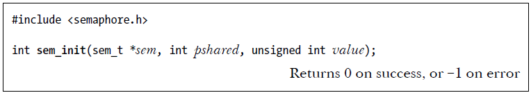
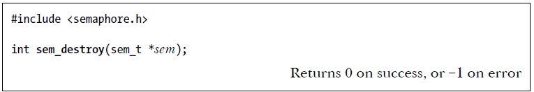

# Unnamed Semaphores Overview
Unnamed semaphores are semaphores that do not have a name associated with them. These semaphores are stored in memory that is allocated by the process, typically within the address space of the process. They are mainly used for synchronization between threads within the same process or, in some cases, for synchronization between processes when shared memory is used.

# Key Points:
1. **Initialization (`sem_init()`)**:
   - The `sem_init()` function is used to initialize an unnamed semaphore. The function informs the system whether the semaphore will be shared between threads of the same process or between multiple processes.
     - **Thread synchronization**: Semaphore is used within the process (default behavior).
     - **Process synchronization**: If shared between processes, the semaphore must be placed in shared memory, typically through some form of inter-process communication (IPC).

2. **Destruction (`sem_destroy()`)**:
   - The `sem_destroy()` function is used to destroy an unnamed semaphore. This should be called when the semaphore is no longer needed. It frees the resources associated with the semaphore and should be done before exiting the program to ensure no resource leaks.
   
3. **Common Operations**:
   - **sem_wait()**: Decrements the semaphore value. If the semaphore value is 0, the calling thread/process will be blocked until the semaphore becomes greater than 0.
   - **sem_post()**: Increments the semaphore value. If there are threads/processes waiting on the semaphore, it unblocks one of them.
   - **sem_getvalue()**: Returns the current value of the semaphore, which can be used for checking the semaphore's state.

# `sem_init()`:

- **Purpose**: The `sem_init()` function is used to initialize an unnamed semaphore, which is a synchronization tool used for controlling access to shared resources.
  
- **Parameters**:
  - **sem**: A pointer to the semaphore object, which is of type `sem_t`.
  - **value**: This is the initial value that the semaphore will be set to. Typically, a value of `0` means that threads or processes attempting to wait (decrement) the semaphore will block until it becomes non-zero.
  - **pshared**: A flag that determines the scope of the semaphore:
    - **pshared = 0**: The semaphore is shared **between threads** of the same process. This means that all threads within the process can access and modify the semaphore.
    - **pshared ≠ 0**: The semaphore is shared **between processes**. In this case, the semaphore must reside in a region of **shared memory** so that it can be accessed by multiple processes.

### `sem_destroy()` Explanation:

- **Purpose**: The `sem_destroy()` function is used to destroy an unnamed semaphore that was previously initialized using `sem_init()`. Destroying a semaphore cleans up any resources associated with it.

- **Condition for Destruction**:
  - It is **safe to destroy a semaphore** only if no threads or processes are currently waiting on it (i.e., no thread or process is blocked on a `sem_wait()` call).
  - Destroying a semaphore while it is still in use could cause undefined behavior, so it should only be done when it is confirmed that no processes or threads are waiting for the semaphore.

- **Usage**:
  - After a semaphore is no longer needed, especially in scenarios where semaphores are shared between processes, it is important to destroy it to free resources and avoid memory leaks.
